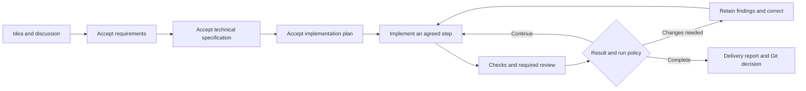

<div align="center">


# ZIAForge

### FORGE. DON'T VIBE.

**Turn an idea into accepted requirements, an executable plan and reviewed work.**

An open-source desktop workspace for deliberate AI development, research and writing.<br />
Use your installed AI CLIs and subscriptions, or connect an API you choose.

[](https://github.com/ZIAForge/ZIAForge/releases/tag/v1.0.11)
[](LICENSE)
[](#download)
[](#languages-and-help)

[**Website**](https://ziaforge.studio) · [**Download 1.0.11**](https://github.com/ZIAForge/ZIAForge/releases/tag/v1.0.11) · [**User guide**](docs/USER_GUIDE.md) · [**Documentation**](docs/README.md) · [**Contribute**](CONTRIBUTING.md)

</div>

---

ZIAForge gives the person directing a project control over its foundations and the agents carrying out the work. Start with a short idea. Discuss goals, constraints and technical choices in the task's **Forge discussion**, revise the documents, accept the plan, then execute the agreed steps with checks and independent review.

You choose how much to delegate: continue one step at a time, stop at selected checkpoints, or let accepted work advance automatically. **Auto never counts as acceptance of unresolved requirements, a proposed implementation plan or a pending review decision.** Changes to the foundation create a new revision and invalidate dependent approvals while preserving completed history.

The application runs locally and keeps its task state, conversations, documents and evidence on your computer. Model requests go to the native CLI or API provider you selected; ZIAForge does not require its own hosted AI subscription.

## At a glance

| Capability | What you can do |
| --- | --- |
| 🧭 **Forge development** | Discuss the product and stack, accept versioned foundations, edit the implementation checklist and control advancement. |
| 🛠️ **Five Code workflows** | Choose Auto, Fix a bug, Spec first, Requirements first or Multi-model for a registered Git repository. |
| 📝 **Five Work workflows** | Use Auto, Brainstorm, Deep Brainstorm, Research or Write in an ordinary folder, with inputs, questions and versioned documents. |
| 🔌 **Your models and tools** | Use supported installed Codex, Claude Code and Antigravity CLIs, an explicitly configured compatible API, or Claude Connector v1 through Anthropic Messages. |
| 👥 **Independent review** | Select individual reviewers or save a parallel review team with an anonymous, report-only architect. |
| 📁 **A practical workspace** | Keep task-local chats, Markdown results, syntax-aware file editing, large-file windows, Git changes and the correct working folder together. |
| 🌐 **Remote operation** | Open the authenticated application UI in a browser, switch saved instances, use a private Telegram bot or connect external agents through MCP. |
| 📚 **Help that follows the product** | Search the guide, ask the local Help assistant through your own connected model, or read generated offline manuals. |

## Download

Get the packages and `SHA256SUMS` from [**ZIAForge 1.0.11**](https://github.com/ZIAForge/ZIAForge/releases/tag/v1.0.11). Choose both the operating system **and** the CPU architecture; x64 and ARM64 packages are separate.

| Your computer | Architecture | Packages |
| --- | --- | --- |
| macOS on Intel | x64 | DMG · ZIP |
| macOS on Apple Silicon, including M-series Macs | ARM64 | DMG · ZIP |
| Windows on Intel/AMD | x64 | Installer EXE · ZIP |
| Windows on ARM | ARM64 | Installer EXE · ZIP |
| Linux on Intel/AMD | x64 | DEB · RPM · AppImage · tar.gz · ZIP |
| Linux on ARM | ARM64 | DEB · RPM · AppImage · tar.gz · ZIP |

Source archives are also included. The [release notes](docs/releases/1.0.11.md) describe distribution and verification limits; [platform instructions](docs/PLATFORM_BUILDS.md) cover prerequisites and build routes. A generated package or cross-build does not establish native execution on every target.

### Install

- **macOS:** requires macOS 13 or newer. Open the matching DMG and copy the complete `ZIAForge.app` into Applications, or extract the ZIP. Version 1.0.11 is unsigned and not notarized; macOS may require your explicit approval. Keep Gatekeeper enabled and verify the download before approving it.
- **Windows:** run the matching installer, or extract the complete ZIP into a writable application directory. Install Git for Code tasks and put it on PATH. Keep the executable with its resources and native libraries. The packages are unsigned, so Windows may display a publisher warning.
- **Ubuntu / Debian:** install the matching DEB through your package manager: `sudo apt install ./downloaded-package.deb`.
- **RPM distributions:** install the matching RPM through your distribution's package manager, for example `sudo dnf install ./downloaded-package.rpm`.
- **AppImage:** mark the download executable and launch it as your ordinary desktop user. Compatible Electron libraries and FUSE 2 are required; the [platform guide](docs/PLATFORM_BUILDS.md) explains the extraction alternative.
- **Linux archives:** extract the complete directory and run `ziaforge` from a graphical desktop session. Archives do not install system dependencies or desktop entries.

Packages include the application runtime, **not** provider accounts, subscriptions, API keys or every AI CLI. Install and authenticate the provider you intend to use. CLI compatibility is version-gated; consult the [supported transports and versions](docs/PROVIDER_COMPATIBILITY.md) before upgrading a client.

To check a download, compare its SHA-256 with the release's `SHA256SUMS`. On macOS use `shasum -a 256 downloaded-file`; on Linux use `sha256sum downloaded-file`; on Windows PowerShell use `Get-FileHash .\downloaded-file -Algorithm SHA256`.

## Your first project

1. **Connect your engine.** Sign in with your provider's own CLI, then create a saved preset in ZIAForge. Alternatively, configure an API connection with its endpoint and credentials. Choose the model, reasoning effort and access policy you want.
2. **Register the repository.** Select it through the local folder picker. For Code, choose the working branch or a worktree. For Work, use a task folder or select an existing folder.
3. **Start with the goal.** For a new product, choose **Requirements first** and describe the initial idea. Save draft keeps it without inference; Start begins the selected workflow.
4. **Build the foundation together.** Answer questions, ask for recommendations, discuss tradeoffs and amend requirements in Forge. Inspect and accept the exact requirements and specification versions when they are ready.
5. **Accept the real plan.** Edit steps and acceptance criteria, inspect the proposed verification commands, choose reviewers and decide between manual and automatic advancement.
6. **Follow the evidence.** Read step chats, documents, checks and review findings. Continue, request changes or authorize a correction. Inspect Git changes before committing, merging or pushing under your chosen policy.

The Code **Requirements first** route follows this progression:



Every transition remains visible. A model's confident answer, a file's existence or a green-looking chat message cannot substitute for the required recorded result.

## Code: choose the right starting point

Code works with registered Git repositories and their selected branches or worktrees. Every task retains its own conversations, stage history, documents and decisions.

| Workflow | What happens | Typical artifacts |
| --- | --- | --- |
| **Auto** | Assesses the request and scope. Repository questions can end with an answer; changes propose concrete work. Large tasks pass through requirements, specification and planning. | `answer.md`, `plan.md`, and foundations when needed; `report.md` after implementation. |
| **Fix a bug** | Investigates expected versus actual behavior and root cause, then proposes a scoped correction and relevant regression checks. | `investigation.md`, retained evidence and `report.md`. |
| **Spec first** | Examines the current architecture, proposes the technical design and breaks down implementation. | `spec.md`, a plan when needed and `report.md`. |
| **Requirements first** | Builds product requirements through discussion, then technical specification and a concrete implementation plan. | Versioned `requirements.md`, `spec.md`, `plan.md` and `report.md`. |
| **Multi-model** | Runs scoped exploration and alternative designs, synthesizes a plan, waits for a plan decision, then coordinates implementation and review. Each role can use its own CLI, model and preset. | Exploration and design reports, `final_plan.md`, implementation evidence, review reports and explicit correction reports. |

**Forge discussion stays available throughout.** A new requirement can return the task to Requirements, Technical Specification or Planning. Accepted foundations are bound to their exact versions and hashes. Revised foundations need fresh dependent acceptance; completed work and earlier evidence remain in history.

Execution supports step dependencies, acceptance criteria, executable verification, optional TDD Red/Green checks, independent reviewers, research helpers and bounded repair attempts. Manual advancement and each step's checkpoint remain available alongside Auto.

Commit, merge and push are **manual by default**. Explicit whole-plan Git policies can automate selected operations after the verified plan and its final checkpoint. Verification binds to the actual files; later changes cannot borrow earlier approval.

Read the [Code workflow contract](docs/WORKFLOWS.md) for decisions, recovery and Git semantics.

## Work: think, research and write

Work runs in ordinary folders and has no Git finalization. Its engine preserves phase state, answers, selected roles, sources and document versions.

| Workflow | Use it for | How you direct it |
| --- | --- | --- |
| **Auto** | A question, analysis or task that may need a plan. | Clarify material ambiguity and accept proposed executable work; small answers need no artificial checklist. |
| **Brainstorm** | Generating alternatives before evaluating them. | Choose more ideas, evaluation or a follow-up direction; retain `ideas.md` and prior results. |
| **Deep Brainstorm** | Several independent perspectives on one question. | Configure workers and a coordinator, answer their questions and review the synthesized `brainstorm_report.md`. |
| **Research** | A scoped investigation with sources and limitations. | Set scope/depth, answer questions, inspect findings and their source records. |
| **Write** | A document with a clear audience, purpose and length. | Develop an outline, inspect a draft and request revisions; manual mode pauses at eligible phases. |

Select file inputs through the local picker and reference their retained copies with `@`. Create up to four independent task copies with separate executor settings. Runs sharing an overlapping folder are coordinated to avoid simultaneous application-owned writers.

Automatic advancement does not answer questions for you, accept a proposed plan or choose a Brainstorm direction. Deep Brainstorm's canonical report always has a user review decision. Substantial documents are retained with immutable versions, so a revision does not discard the previous result.

See [Work modes and decisions](docs/WORK_WORKFLOWS.md).

## Models, presets and specializations

ZIAForge uses **structured provider interfaces** rather than scraping an interactive terminal screen:

| Connection | Integration | Authentication |
| --- | --- | --- |
| Codex | Native App Server stdio | Your installed CLI's login |
| Claude Code | Persistent stream-json | Your installed CLI's login |
| Antigravity | Supported headless stream-json | Your installed CLI's login |
| API | Explicit streaming Chat Completions, Responses or Claude Connector v1 Anthropic Messages | Your explicitly configured endpoint and optional API key |

Responses connections support caller workspace tools, separately approved local commands on macOS/Linux, provider progress cards and private generated-image previews with Save and an expandable viewer (zoom, 100%, fit and pan). Server tools operate remotely; they never dispatch local commands. Windows local API commands are not yet available. Existing API connections keep Chat Completions until explicitly changed. Use **Set up Responses** in Connections, save, then **Apply** the same connection in the chat. The chat header shows its pinned protocol; history is retained.

The explicit **Grok Connector v1** Responses profile adds native question and permission cards, advertised context-window choices, capability/usage inspection and private input images. Answers continue the same owned turn; Stop cancels it without replaying an uncertain decision. Choose images through the system file dialog and inspect accepted or generated images with the existing Save and zoom controls. Provider tools stay separate from local workspace tools. Verified video-capable Grok servers also support conversational image-to-video and reference-to-video, an inline MP4 player and Save video. Standalone audio generation and tool-free Help/report-architect sessions remain unavailable. See the [Grok connection guide](docs/GROK_CONNECTOR.md).

The explicit **Claude Connector v1** profile uses Anthropic Messages and a connector origin without `/v1`. Caller mode operates in the local task folder with separate approvals; provider-native mode runs selected tools in the server workspace and supplies no local tools. Native questions and permissions require the owner's decisions by default. System pickers support PNG/JPEG/GIF/WebP images, PDF and UTF-8 text. Server-created files appear as Save-only cards with immutable versions; saving reuses verified private bytes and a native destination dialog. Owned continuation preserves its pinned configuration, while interrupted tools and decisions are never replayed after restart. Cold-history import is explicit and lossy. These file artifacts do not imply native image, video or audio generation. See the [Claude connection guide](docs/CLAUDE_CONNECTOR_V1.md).

Native subscription access and API billing are separate choices. Model availability and limits belong to the selected provider and account. An unsupported CLI version fails visibly before prompt delivery; ZIAForge does not silently switch transport or provider.

The model catalog is refreshed from the chosen CLI or API where its protocol supports discovery. You can enter a model ID explicitly when discovery is unavailable. Reasoning effort follows the selected model's supported levels; **Provider default** and explicit `none` are distinct settings.

Saved presets and **Custom** are available for executors and reviewers, including reuse of the same preset across independent contexts. The chat composer places provider/model settings beside the input; changing a provider while idle keeps visible history without claiming to migrate the provider's private internal state.

Choose an instruction specialization independently of the model: **None**, **Standard**, **Auto** or **Manual**. Built-in guidance covers general engineering, architecture, security, reliability, performance, testing and usability. A specialization directs attention; it does not grant tools, change permissions or certify expertise.

[Provider compatibility](docs/PROVIDER_COMPATIBILITY.md) · [API connections](docs/API_CONNECTIONS.md) · [Extending providers](docs/PROVIDER_EXTENSION.md)

## Review from several perspectives

Run independent reviewers in parallel, including different models in one CLI or several CLI/API providers. Save a reusable **Review team** with reviewer configurations and a separate report architect.

- Reviewers examine the same task evidence in separate contexts. Each report, error and verdict is retained.
- The report architect sees **anonymous numbered reports**, without reviewer/model/provider identities, repository access or tools. It compares the reports and returns an aggregate verdict; it does not conduct another source review.
- A required rejection, missing report or blocking finding cannot be waived by a majority vote or architect preference.
- The isolated report-architect role currently supports verified tool-free Claude/API configurations. Codex and Antigravity can serve as reviewers but do not receive this architect role.

Code's Multi-model pipeline and a saved parallel review team are separate controls. Select the policy that matches your task; choosing one does not silently replace the other.

## A workspace you can inspect

**Conversations:** task-local tabs and history, correctly rendered Markdown, separate CLI diagnostics, Stop beside the input and explicit session resume. The durable input queue has its own pause/continue control. Full Quit pauses interrupted work; reopening does not silently resend uncertain input or repeat completed steps.

**Documents and files:** open versioned artifacts, edit text with syntax by extension, search and replace, undo, line wrapping and per-tab drafts. Saves preserve supported UTF-8/UTF-16 encodings and reject external modification conflicts. Full syntax works through 8 MiB; larger files use 256 KiB windows, with an optional full plain-text load through 64 MiB. Above that, use window editing and bounded search or an external editor.

**Working-folder visibility:** open the current task/branch/worktree folder in the file manager or reveal a file's parent directory. Provider launch resolves that registered task directory and refuses a missing grant instead of falling back to your home folder.

**Git and recovery:** inspect changed files and recorded operation outcomes, preserve uncommitted work, and recover damaged metadata from a selected validated backup. Unsaved editor drafts require an explicit save/discard decision.

A worktree, working directory or provider permission option is **not an operating-system sandbox**. Choose provider access deliberately; native tools run with capabilities available to your account.

## Remote control and external agents

Remote control is disabled until the local owner enables it. Its browser serves the **same current application interface**, backed by authenticated typed commands and events.

| Interface | Capability |
| --- | --- |
| **Browser** | Observe with `read` scope or perform permitted application actions with `operate`; the default listener is loopback. |
| **Saved instances** | Switch between separately configured ZIAForge installations, each with its own profile, port, files and provider accounts. |
| **Application architect** | Use your selected model to inspect task/chat summaries, request app screenshots, operate authorized workflows and change permitted ordinary settings. |
| **Private Telegram bot** | Use localized inline menus for status, projects, tasks, progress, chat previews, actions, screenshots and architect requests. |
| **MCP and HTTP** | Give an external agent the current command catalog and canonical guide, then act through the same workflow and permission boundaries. |
| **Local `ziaf` CLI** | Inspect, start and pause saved plans through the running application's existing engine. |

Telegram is bound to the owner's numeric ID in a private chat. Menus use paginated lists and expiring, single-use action buttons. Task chat previews do not implicitly send new messages into that task. The application must be running for remote control and bot polling.

Screenshots can be displayed or returned to external clients. The built-in application architect does not currently analyze image pixels.

The MCP stdio bridge exposes `ziaforge_status`, `ziaforge_commands`, `ziaforge_command` and `ziaforge_screenshot`. [OpenClaw and Hermes setup](docs/AGENT_CONTROL.md) includes configuration examples and agent operating instructions; those clients are installed and configured separately. The browser root URL is not an HTTP MCP endpoint.

Neither remote clients nor the application assistant can enable native computer permission for themselves. The local owner controls it separately, along with folder grants and credential changes. Exposing ordinary HTTP outside loopback requires your own encrypted network arrangement, such as a VPN, SSH tunnel or HTTPS proxy.

Read [the control guide](docs/AGENT_CONTROL.md) before connecting an external client. Begin with status and the current command catalog; preserve task, gate, revision and operation identities after uncertain outcomes.

## Languages and help

The interface offers **56 languages**, including right-to-left layouts. Telegram can follow the application's language or use a private bot preference. Identifiers such as model IDs, file paths and command names remain unchanged.

Open **Help** for searchable product instructions, or ask the separate **Help assistant** using a saved connected AI preset. It answers from the current canonical guide and links its sections. It has no application command executor or live project context; the application architect is a separate feature.

English is the canonical help source. The other 55 guides are currently **machine-translated and labelled as such**, with source hashes and a separate human-review status. Newly changed sections may explicitly show the English reference while unchanged translations retain their provenance. Offline Markdown manuals and HTML guides are generated from the same package. Contributions from native speakers are welcome.

[English guide](docs/USER_GUIDE.md) · [Language coverage and manuals](docs/help/LOCALES.md) · [Help maintenance](docs/HELP_MAINTENANCE.md) · [Localization](docs/LOCALIZATION.md)

## Website and documentation

The official project landing is [**ziaforge.studio**](https://ziaforge.studio). Downloads, source code and issue reports remain on [GitHub](https://github.com/ZIAForge/ZIAForge).

The separate [documentation website](https://ziaforge.github.io/ZIAForge/) presents the same product guide in all 56 application languages with searchable navigation, a responsive reading layout and the project's inherited visual identity. Machine translation and native-speaker review remain separate statuses.

Run `node scripts/website/serve.cjs --port 4173` and open `http://127.0.0.1:4173/website/guide.html` to read the guide locally. See [website setup](website/README.md) and [documentation delivery](docs/WEBSITE.md). The Studio landing and films have a separate hosting scope from the documentation-only build.

## Data, permissions and updates

Task state and history are local. Using a selected model sends the relevant prompt/context to that provider under its own account and service rules. Remote control and Telegram can transmit project information and screenshots to their configured destinations.

API, Telegram and saved-instance credentials use the operating system's encrypted storage. Linux needs an unlocked Secret Service or KWallet backend; insecure plaintext fallbacks are refused. ZIAForge does not extract native provider credentials or edit their global authentication configuration.

Open **Settings → Updates → Check for updates**. The official `ZIAForge/ZIAForge` repository and **Stable** channel are ready by default. **Update** downloads and verifies the matching package, then updates after a normal Quit. Optional automatic checking/downloading never installs without the owner’s action. System installer/authentication prompts and manual installation for unsupported layouts are explained in [application updates](docs/UPDATES.md). Profiles, task history and project files are retained.

The Automations page currently retains UI definitions and counters; it is **not a recurring scheduler**. Actual plan execution/control is provided by the workflow engine, the local CLI and authenticated control API.

[Security policy](SECURITY.md) · [Recovery](docs/DATA_RECOVERY.md) · [Message queues](docs/MESSAGE_QUEUE.md)

## Develop and build from source

Use Git, **Node.js 24 LTS** and npm. Native dependencies need platform build tools: Xcode Command Line Tools on macOS, a C/C++ toolchain and Python on Linux, or Visual Studio C++ build tools and Python on Windows.

```sh
git clone -c core.autocrlf=false https://github.com/ZIAForge/ZIAForge.git
cd ZIAForge
npm ci
npm run dev
```

Keep dependency lifecycle scripts enabled. Install dependencies for the current OS/architecture; do not copy `node_modules` between targets.

Useful contributor commands:

```sh
npm run qa:doctor           # Local prerequisites
npm run build:e2e           # Compile without issuing a release
npm run qa:check -- --e2e   # Retained checks and isolated Electron fixtures
npm run qa:inspect          # Isolated visible app for UI inspection
npm run locales:check       # Interface dictionaries
npm run help:check          # Generated help and local links
```

Fixture checks do not require a paid model account. Native model inference, package structure, target execution and GUI checks are reported separately. Inspect the exact source/build identity before comparing visual results.

The source includes Mac DMG/ZIP, Windows installer/ZIP and Linux DEB/RPM/AppImage/archive routes, a pinned container build environment and a native CI matrix. Official packages use a frozen source identity and retained version allocation; they never overwrite an earlier output. Follow [platform builds](docs/PLATFORM_BUILDS.md), [Mac builds](docs/MACOS_BUILD.md) and [build entry points](docs/BUILD.md) for exact commands rather than changing versions independently.

### Source map

| Directory | Responsibility |
| --- | --- |
| `electron/` | Trusted process, registered folders, providers, workflows, review, persistence and app control |
| `shared/` | Typed contracts, state and conversation projection shared across clients |
| `src/` | React interface, task navigation, editor, settings and language dictionaries |
| `docs/` | Current product guide, feature contracts, contributor and build instructions |
| `scripts/` | Local CLI/MCP, help generation, isolated checks and immutable packaging |
| `e2e/` | Real Electron user flows with deterministic provider peers |
| `website/` | Landing page and generated offline help |

[Project map](docs/PROJECT_MAP.md) · [Documentation index](docs/README.md) · [Contributor guide](CONTRIBUTING.md) · [AI agent contract](AGENTS.md)

## Contribute

Bug reports, focused improvements, native-platform feedback and language review are welcome. Include the application/build identity, OS and architecture, provider version, reproduction and expected result. Remove private prompts, project contents, credentials and personal data from attachments.

For a code change, read the current contract, preserve manual and automatic workflows, and provide meaningful evidence for the affected boundary. Update the canonical help with user-facing changes; do not hand-edit generated manuals. Native clients and remote agents use the same approval and task identity rules as the UI.

[Open an issue](https://github.com/ZIAForge/ZIAForge/issues) for non-sensitive problems. For vulnerabilities, follow [SECURITY.md](SECURITY.md). See [CONTRIBUTING.md](CONTRIBUTING.md) for setup, documentation, checks and publication rules.

## License

ZIAForge source is licensed under [Apache-2.0](LICENSE). Dependencies keep their own licenses and notices. The distributed workflow instructions are source-owned; private chats, local guide contents, provider credentials and unrelated proprietary resources are not included in the public source grant.

See [asset provenance](docs/ASSET_PROVENANCE.md) and the notices included with each package.
