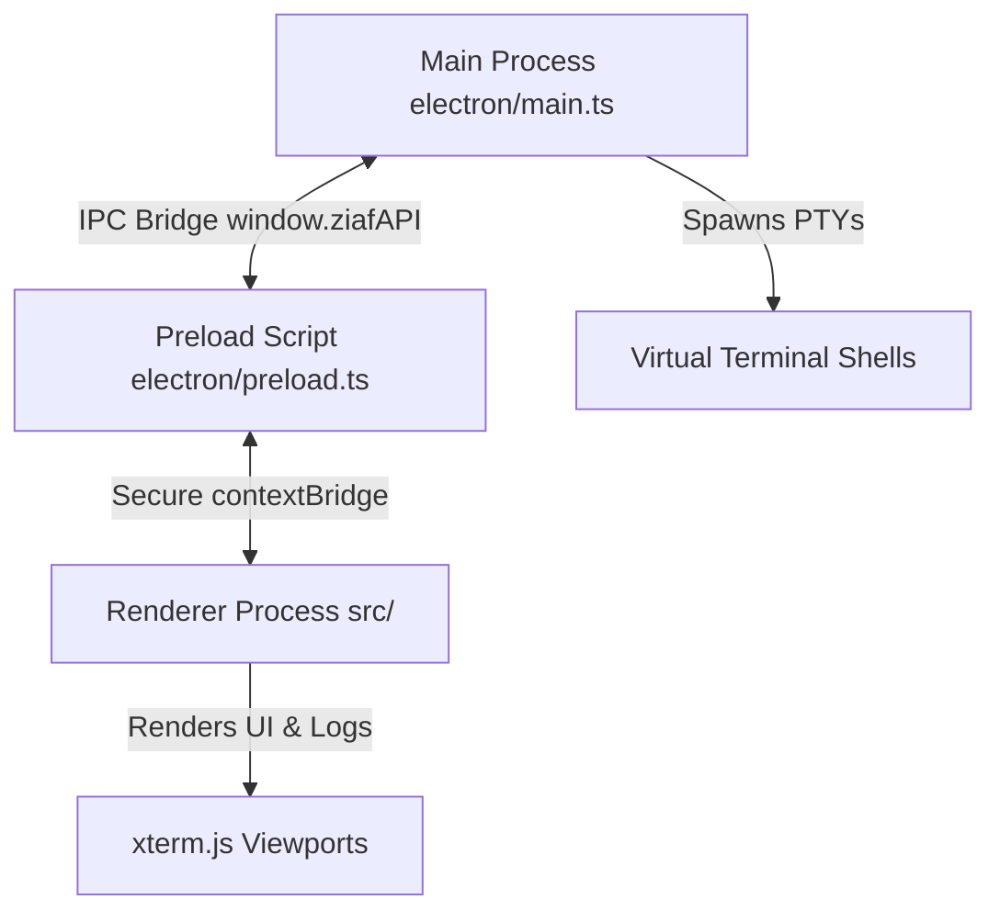

# ZIAForge Architecture Overview

This document retains early architectural intent. Its terminal-first sections are historical, not the current provider path. Current structured sessions and extension boundaries are documented in [PROVIDER_EXTENSION.md](PROVIDER_EXTENSION.md), orchestration in [WORKFLOWS.md](WORKFLOWS.md), and release verification in [TESTING.md](TESTING.md).

---

## 🏗️ Core Technology Stack

- **Desktop Shell**: [Electron](https://www.electronjs.org/) (Node.js main process, Chromium renderer).
- **Frontend App**: [React 18](https://react.dev/), [TypeScript](https://www.typescriptlang.org/), [Tailwind CSS 4](https://tailwindcss.com/).
- **Bundler & Build Tool**: [Vite 8](https://vite.dev/) with `vite-plugin-electron` for Electron integration.
- **Terminal Rendering**: [xterm.js](https://xtermjs.org/) with the `xterm-addon-fit` addon.
- **State Management**: [Zustand](https://github.com/pmndrs/zustand).

---

## 🔄 Process Model & IPC Bridge

ZIAForge follows Electron's multi-process architecture to separate security/system access from the user interface rendering:

### 1. Main Process (`electron/main.ts`)
- Manages desktop window lifecycles, configuration, and app settings.
- Interacts directly with the OS filesystem, executes terminal command streams, and spawns virtual Pseudo-Terminals (PTY).
- Implements secure IPC handlers to process database resets, configuration updates, and shell I/O.

### 2. Preload Script (`electron/preload.mjs`)
- Exposes a minimal, highly restricted api (`window.ziafAPI`) using `contextBridge` and `ipcRenderer`.
- Prevents raw Node.js module access in the frontend renderer process to mitigate security vulnerabilities.

### 3. Renderer Process (`src/`)
- A single-page React app rendering the desktop workspace.
- Houses the Zustand stores managing tabs, workspace directories, active tasks, chat histories, and integration panels.

---

## 🛠️ Key Engine Components

### 1. PTY Wrapper Engine
Instead of attempting to translate complex, stateful CLI output into static UI displays, ZIAForge launches CLI tools (like Claude Code, Git commands, or Google Antigravity) directly inside virtual terminals.
- Spawns terminal shells dynamically on the host machine.
- Pipes stdin and stdout streams directly through IPC.
- Renders outputs in real time inside `xterm.js` components in the React interface.
- Acts as a security proxy, allowing ZIAForge to monitor inputs/outputs and trigger circuit breakers (apology loop detectors) to save API tokens.

### 2. Zustand State Architecture
ZIAForge uses Zustand to handle lightweight, reactive state management across all workspace viewports:
- **Workspace Store**: Keeps track of active directories, current file paths, and target Git repositories.
- **Task Store**: Manages the status of active runs, planning step checklists (`task.md`), and telemetry diagnostic info.
- **UI Store**: Handles active tabs, split layouts, sidebar toggles, and appearance styles.

### 3. Sandbox Git Worktree Isolation
For coding agents running in `Code Mode`, ZIAForge provides automated filesystem isolation:
- Creates a clean Git Worktree from a target base branch.
- Performs code modifications inside this isolated directory.
- Runs verification/test suits (e.g. PHPUnit, Playwright, Jest) within the worktree context.
- Prompts for interactive user approval before pushing or merging back into the main repository branch.

---

## 🤖 Model Routing & Specialist Agent Roles

ZIAForge splits cognitive tasks across specialized models to optimize response times, capabilities, and API costs:

| Agent / Model Role | Primary Responsibility | Calling Mechanism | Optimization / Interactive Checkpoint |
| :--- | :--- | :--- | :--- |
| **`active-coder`** (e.g. Claude Code) | Writing production code, refactoring, writing unit tests. | Spawned as terminal CLI inside PTY wrapper. | Interactive worktree execution. Full thought streaming to frontend console view. |
| **`active-reviewer`** (e.g. o3-mini) | Multi-file code reviews, safety audits, validation of logical flows. | OpenAI-compatible API calls via LiteLLM. | Triggered asynchronously before merging/finishing a task. |
| **`active-cheap-agent`** (e.g. Gemini Flash) | Searching files, parsing log files, updating checklist progress. | API calls via LiteLLM Gateway or local Ollama. | Cost-efficient; used by default for all background orchestration steps. |
| **`agy (Google Antigravity)`** | Sandbox browser automation, complex cross-file workflows. | Spawned as CLI `agy` inside PTY wrapper. | Utilizes Google Antigravity Ultra subscriptions with real-time terminal output. |

---

## 📂 Folder Layout Specs (`.agent/`)

Every ZIAForge-managed repository contains a dedicated `.agent/` folder for workflow data:
- `agent.config.json`: Workspace configuration (ports, active models, PTY commands).
- `planning.md`: Checklist of steps for the current coding loop.
- `memory.md`: Knowledge base capturing lessons learned and project quirks.
- `prompt.md`: System instructions provided to coding models.
- `artifacts/`: Diagnostic build artifacts, test runs, and proposed code diffs.
- `logs/`: Daily detailed telemetry logs.
