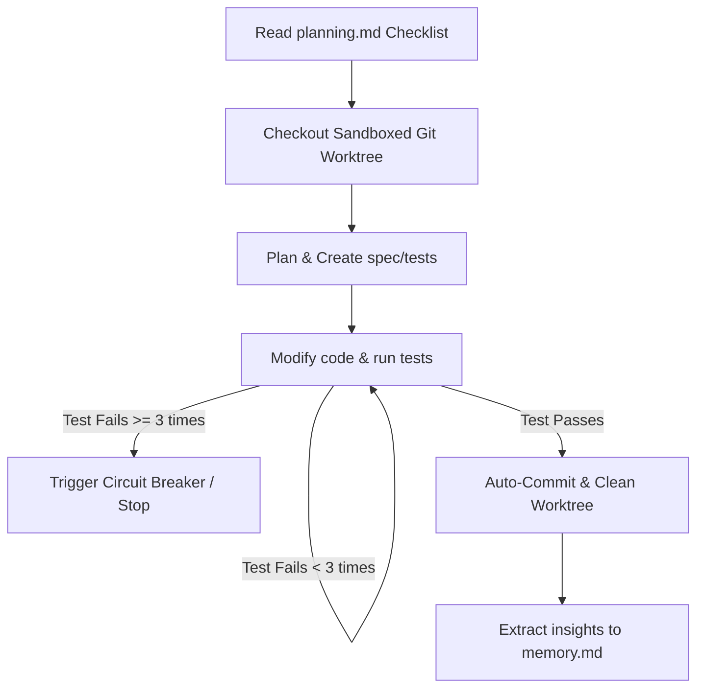

# ZIAForge Core Operational Loop

> Historical design intent. This document preserves the project vision; it is not a current feature or security certification. For implemented behavior and limits, use [README](../README.md), [workflows](WORKFLOWS.md) and [provider compatibility](PROVIDER_COMPATIBILITY.md).

This document describes the step-by-step execution cycle of the ZIAForge agentic workflow (`ziaf --until-success`).

---

## 🔄 The Loop Diagram

The loop guides the agent from planning to production-ready verification:

---

## 🏃 Step-by-Step Cycle

### 1. Specification Reading (`planning.md`)
The orchestrator reads the `.agent/planning.md` file in the project. It identifies the first incomplete task marked as `- [ ]`.

### 2. Git Worktree Isolation
Instead of editing the active working branch of the developer, the CLI spawns a new sandboxed git worktree:
- Command: `git worktree add ../worktrees/ziaf-task-<name> -b ziaf-branch-<name>`
- This isolates the agent's work, preventing files from being modified on the main developer's view until validation is complete.

### 3. TDD & Spec Generation
- **Spec First**: The agent generates or updates specifications (e.g. `planning.md` steps) and defines requirements.
- **Tests First**: Before writing functional code, the agent writes test cases matching the new requirements and runs them to verify they fail (Red phase).

### 4. Implementation & Verification Loop
- The agent updates the code implementation to satisfy the test failures.
- Runs the test suite command (e.g. `npm run test` or `php artisan test`).
- **Feedback Loop**: If tests fail, the stderr output and stack trace are fed back into the agent's context. The agent attempts to fix the bugs and run the tests again (capped at 3 attempts per individual failure).
- **Circuit Breaker**: If tests continue to fail after the maximum limit, the execution stops and requests user intervention.

### 5. Automated Git Commit
- Once the tests pass successfully, the agent automatically stages the changes: `git add -A`.
- Automatically generates a commit message conforming to Conventional Commits guidelines (e.g. `feat: ...`, `fix: ...`).
- Cleans up the temporary Git Worktree directory and merges changes.

### 6. Memory Logging (`memory.md`)
- The agent analyzes the technical hurdles it encountered, the structure of the classes, and lessons learned.
- Appends these insights to `.agent/memory.md` to ensure future runs do not repeat the same mistakes.
