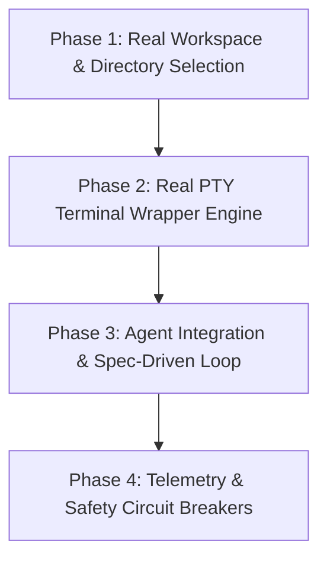

# ZIAForge Implementation Roadmap

> Historical design intent. This document preserves the project vision; it is not a current feature or security certification. For implemented behavior and limits, use [README](../README.md), [workflows](WORKFLOWS.md) and [provider compatibility](PROVIDER_COMPATIBILITY.md).

This document outlines the step-by-step roadmap to transition ZIAForge from a visual/mock prototype to a fully functional desktop application.

---

## ⚙️ Core Strategy: Dual Mode (Real vs. Mock)

To preserve the initial "Version 0.0.0" concept walkthrough, we will maintain a **Mock Mode** toggler in the application settings (`useMockData: true/false`).
- **Mock Mode (Default/Demo)**: Feeds the UI with the original prototype data, mock repositories, and simulated terminal log streaming. Useful for demos, UI layout changes, and offline walkthroughs.
- **Production Mode (Real)**: Interacts directly with the local filesystem, executes real Git commands, parses local specifications, and spawns real pseudo-terminals (PTYs).

---

## 🗺️ Execution Phases

### 📂 Phase 1: Real Workspace & Directory Selection (Completed)
Transition from hardcoded projects (`LeadTracker`, etc.) to actual directories on the developer's computer.

#### 1. File Selector Dialog
- Implement `ziafAPI.selectDirectory()` in Electron main: opens native OS folder selection dialog.
- Return selected folder path and resolve directory name.

#### 2. Workspace Storage Paths & Config Defaults
When a repository is selected, ZIAForge needs to store workspace-specific metadata (chats, worktrees, caches). We establish:
- **Default Paths**:
  - **Worktrees Path**: `<project-root>/release/worktrees/` (local and git-ignored).
  - **Chats & Settings**: Electron's local user app data folder (`app.getPath('userData')`).
  - **Task Specs**: Root `.agent/` folder of the selected project.
- **Custom Configuration**:
  - Expose inputs in the **Git Settings** UI panel to allow users to override these default folders.

#### 3. Real Git Verification
- Query `git rev-parse --is-inside-work-tree` to check if selected folder is a valid Git repository.
- Retrieve active local branches: `git branch`.

#### 4. Active File Explorer
- Implement IPC handlers to list directory files recursively.
- Populate the sidebar File Explorer view with real files.

---

### 💻 Phase 2: Real PTY Terminal Wrapper Engine (In Progress)
Connect frontend console outputs to real shells.
- Integrate `node-pty` in Electron main.
- Pipe shell standard streams to xterm.js viewports.
- Execute real command scripts (`npm run build`, tests) and stream stdout.

---

### 🤖 Phase 3: Agent Integration & Spec-Driven Loop
Execute coding loops in safe sandboxed worktrees.
- Automatically check out a branch to the designated worktrees directory.
- Spawn AI agent CLI (e.g. Claude Code, AGY) inside the worktree directory.
- **Spec Parser (`planning.md`)**:
  - Read `.agent/planning.md` inside the selected folder.
  - Parse markdown check-items (`- [ ]` / `- [x]`).
  - Expose IPC updates: checking a box in the ZIAForge UI writes the changes back to `planning.md`.
- Implement the validation test loop (re-run tests, feed stack-traces back to agent).
- Generate Conventional Commits messages and merge.

---

### 📊 Phase 4: Telemetry & Safety Circuit Breakers
Enhance execution telemetry and safety hooks.
- Monitor character generation to compute actual tokens/second.
- Add loop apology detection to prevent infinite run loops.
